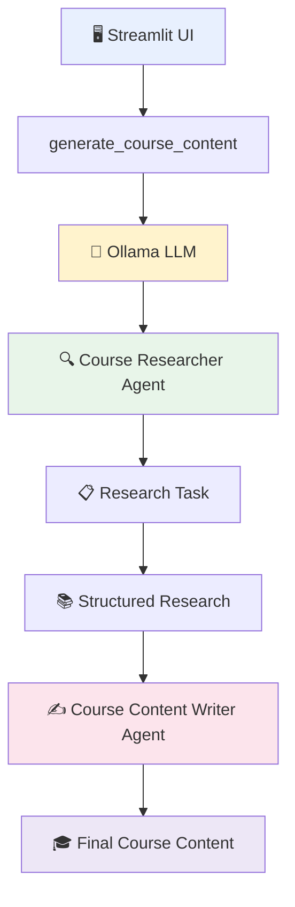
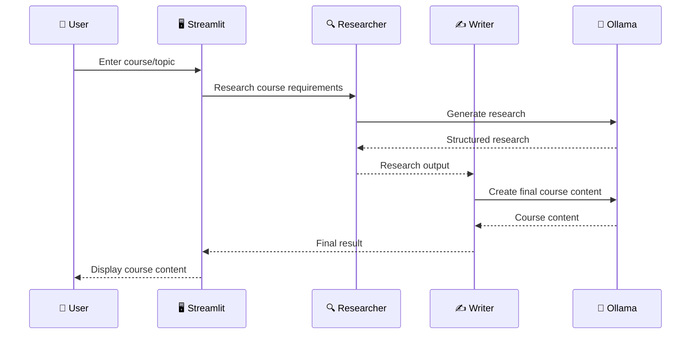
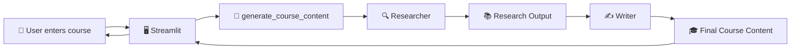
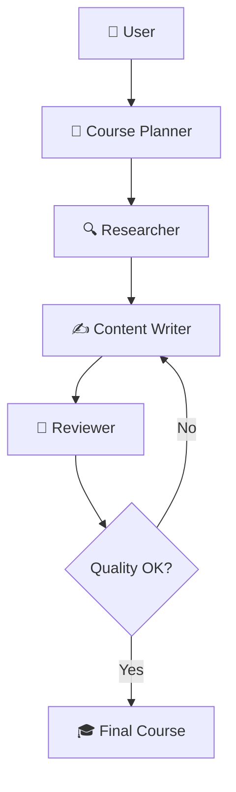

# 🎓 CrewAI Ollama Course Content Generator

A beginner-friendly **CrewAI multi-agent application** that generates student-friendly course content using a **local Ollama model** instead of OpenAI.

This project demonstrates how multiple AI agents can collaborate on a task:

- 🔍 A **Course Researcher** analyzes the course and identifies important learning material.
- ✍️ A **Course Content Writer** uses the research output to create structured, student-friendly course content.
- 🧠 **Ollama** provides the local LLM.
- 🖥️ **Streamlit** provides the web interface.

> 💡 **Why Ollama?** Your prompts and generated content can be processed by a local model instead of requiring an OpenAI API key.

---

## 📸 Project Architecture

The overall workflow is:



### Simple mental model

```text
                 🖥️ Streamlit
                      |
                      v
          generate_course_content()
                      |
                      v
                🧠 Ollama LLM
                      |
             +--------+--------+
             |                 |
             v                 v
       🔍 Researcher       ✍️ Writer
          Agent              Agent
             |                 ^
             v                 |
       Research Task ----------+
             |
             v
     📚 Structured Research
             |
             v
      🎓 Final Course Content
```


---

## 🤖 Agents

### 1. Course Researcher 🔍

The **Course Researcher** focuses on understanding what students need to learn.

It identifies:

- Important topics
- Core concepts
- Required student skills
- Practical project ideas
- Learning progression
- Useful course structure

### 2. Course Content Writer ✍️

The **Course Content Writer** receives the research output and turns it into student-friendly course content.

It produces:

- Course introduction
- Course highlights
- Important topics
- Required skills
- Practical projects
- Learning outcomes
- Student-friendly summary

### Agent collaboration



---

## 🧩 Key CrewAI Concepts Demonstrated

This project is designed as a learning project and demonstrates:

| Concept | What it demonstrates |
|---|---|
| **Agent** | Defines an AI worker with a specific role |
| **Role** | Gives the agent a clear responsibility |
| **Goal** | Defines what the agent should accomplish |
| **Backstory** | Provides context and behavior for the agent |
| **Task** | Defines work that an agent must perform |
| **Task Context** | Allows one task to use another task's output |
| **Crew** | Coordinates multiple agents and tasks |
| **Sequential Process** | Executes tasks in a defined order |
| **Local LLM** | Uses Ollama instead of a cloud API |
| **Streamlit** | Provides the interactive web UI |
| **Environment Variables** | Keeps configuration outside the source code |

---

## 🏗️ Project Structure

A typical project structure looks like this:

```text
crewai-ollama-course-generator/
│
├── 📄 app.py
├── 📄 main.py
├── 📄 requirements.txt
├── 📄 .env.example
├── 📄 .gitignore
├── 📄 README.md
│
└── 📁 .venv/
```

### File responsibilities

| File | Purpose |
|---|---|
| `app.py` | Streamlit user interface |
| `main.py` | CrewAI agents, tasks, crew, and generation workflow |
| `requirements.txt` | Python dependencies |
| `.env.example` | Example environment configuration |
| `.gitignore` | Prevents files such as `.env` and `.venv` from being committed |
| `README.md` | Project documentation |

---

# ⚙️ Requirements

Before starting, make sure you have:

- Windows, macOS, or Linux
- Python **3.10–3.13**
- [Ollama](https://ollama.com/)
- A downloaded Ollama model
- Internet access for installing Python packages
- Packages listed in `requirements.txt`

> ⚠️ **Python version note:** If your environment has Python 3.14, use Python 3.13 for this project when your installed CrewAI dependency set does not support Python 3.14.

---

# 🚀 Installation

## 1. Install Python 3.13

Check your current Python version:

```powershell
python --version
```

If your system reports Python 3.14, create this project using Python 3.13.

### Windows

Create a virtual environment:

```powershell
py -3.13 -m venv .venv
```

Activate it:

```powershell
.venv\Scripts\activate
```

You should see something similar to:

```text
(.venv) PS C:\YourProject>
```

Verify:

```powershell
python --version
```

Expected:

```text
Python 3.13.x
```

---

## 2. Install Python packages

Upgrade `pip`:

```powershell
python -m pip install --upgrade pip
```

Install the project dependencies:

```powershell
pip install -r requirements.txt
```

---

# 🦙 3. Install Ollama

Install Ollama for your operating system.

After installation, verify that it is available:

```powershell
ollama --version
```

If the command returns a version number, Ollama is installed correctly.

---

# 🧠 4. Download an Ollama Model

A recommended starting model is:

```powershell
ollama pull llama3.2:3b
```

Check the installed models:

```powershell
ollama list
```

You should see your downloaded model in the list.

### Test the model

Run:

```powershell
ollama run llama3.2:3b
```

Then enter:

```text
Explain Agentic AI in simple English.
```

If the model responds, your local LLM is working.

Exit the Ollama prompt when finished.

---

# 🔐 5. Configure Environment Variables

Copy:

```text
.env.example
```

to:

```text
.env
```

Example configuration:

```env
OLLAMA_MODEL=llama3.2:3b
OLLAMA_BASE_URL=http://localhost:11434
OLLAMA_TEMPERATURE=0.2
OLLAMA_TIMEOUT=180
```

### Using another model

If you use another Ollama model, change:

```env
OLLAMA_MODEL=llama3.2:3b
```

For example:

```env
OLLAMA_MODEL=llama3.2:latest
```

The model name in `.env` must match the model shown by:

```powershell
ollama list
```

---

# 🖥️ 6. Start Streamlit

Run:

```powershell
streamlit run app.py
```

Streamlit will display a local URL in the terminal.

Usually:

```text
http://localhost:8501
```

Open that address in your browser.

---

# 🔄 How the Application Works

The application follows a simple multi-agent pipeline:



### Step-by-step

**1. User enters a course/topic**

Example:

```text
Python Programming for Beginners
```

**2. Streamlit receives the input**

The UI passes the course information to:

```text
generate_course_content()
```

**3. Course Researcher runs**

The researcher identifies:

```text
Topics
    ↓
Core concepts
    ↓
Skills
    ↓
Projects
    ↓
Learning progression
```

**4. Research output becomes task context**

The writer receives the researcher's output.

This is an important CrewAI concept:

```text
Research Task
      |
      v
Structured Research
      |
      v
Writer Task Context
```

**5. Course Writer creates the final content**

The writer converts the research into:

```text
Introduction
Highlights
Topics
Skills
Projects
Learning Outcomes
Student Summary
```

**6. Streamlit displays the result**

The final course content is returned to the user.

---

# 🔗 Why Task Context Matters

One of the most important learning concepts in this project is **task context**.

Instead of allowing the writer to work independently:

```text
❌ Researcher
      |
      X
Writer
```

the researcher output is passed to the writer:

```text
✅ Researcher
      |
      v
Research Output
      |
      v
Writer
      |
      v
Final Content
```

This creates a simple information pipeline between agents.

---

# 🧠 CrewAI + Ollama Architecture

This project uses a local LLM architecture:

```text
┌──────────────────────┐
│      CrewAI          │
│  Multi-Agent Layer   │
└──────────┬───────────┘
           │
           v
┌──────────────────────┐
│ LiteLLM Integration  │
└──────────┬───────────┘
           │
           v
┌──────────────────────┐
│       Ollama         │
│   Local LLM Server   │
└──────────┬───────────┘
           │
           v
┌──────────────────────┐
│   llama3.2:3b        │
│    Local Model       │
└──────────────────────┘
```

The important distinction is:

```text
CrewAI
   ↓
Agent orchestration

Ollama
   ↓
Local model runtime

Streamlit
   ↓
User interface
```

---

# 🔒 No OpenAI API Key Required

This project does **not** require:

```env
OPENAI_API_KEY=
```

The application uses a local Ollama model instead.

### Original cloud-style architecture

```text
CrewAI
   ↓
Cloud LLM API
   ↓
OpenAI
```

### This project's architecture

```text
CrewAI
   ↓
LiteLLM integration
   ↓
Ollama
   ↓
Local model
```


> 🔐 Keep your `.env` file private even when it does not contain an OpenAI key. It is good practice to keep environment-specific configuration out of Git.

---

# 🛠️ Troubleshooting

## ❌ Ollama connection error

Make sure Ollama is installed and running.

Check:

```powershell
ollama list
```

You can also test the local Ollama service:

```text
http://localhost:11434
```

If the service is not reachable, start/restart Ollama and try again.

---

## ❌ Model not found

First check installed models:

```powershell
ollama list
```

Make sure `.env` contains the exact model name.

For example:

```env
OLLAMA_MODEL=llama3.2:3b
```

Then download it if necessary:

```powershell
ollama pull llama3.2:3b
```

---

## ❌ CrewAI installation fails on Python 3.14

Check:

```powershell
python --version
```

If you are using Python 3.14, create a Python 3.13 environment:

```powershell
py -3.13 -m venv .venv
```

Activate it:

```powershell
.venv\Scripts\activate
```

Then reinstall:

```powershell
python -m pip install --upgrade pip
pip install -r requirements.txt
```

---

## ❌ Streamlit command not found

Make sure your virtual environment is activated:

```powershell
.venv\Scripts\activate
```

Then install Streamlit:

```powershell
pip install streamlit
```

You can also launch Streamlit through Python:

```powershell
python -m streamlit run app.py
```

---

# 🧪 Useful Verification Commands

Use these commands to quickly verify your environment:

### Python

```powershell
python --version
```

### Pip

```powershell
pip --version
```

### Ollama

```powershell
ollama --version
```

### Ollama models

```powershell
ollama list
```

### Test model

```powershell
ollama run llama3.2:3b
```

### Streamlit

```powershell
streamlit --version
```

---

# 📚 Learning Goals

This project is intended as a practical introduction to **Agentic AI with CrewAI**.

By studying this project, you can learn:

- 🤖 Multi-agent AI
- 👤 Agent roles
- 🎯 Agent goals
- 📖 Agent backstories
- 📋 Tasks
- 🔗 Task context
- 🔄 Sequential processes
- 🧠 Local LLMs
- 🦙 Ollama
- 🖥️ Streamlit
- 🔐 Environment variables
- 🤝 Agent collaboration
- 🔀 Agent-to-agent workflow
- 🧩 LLM orchestration

---

# 🎯 What You Should Understand After Completing the Project

You should be able to explain:

### What is an Agent?

```text
Agent
  =
Role + Goal + Backstory + LLM
```

### What is a Task?

```text
Task
  =
Specific work assigned to an Agent
```

### What is Context?

```text
Task A Output
      ↓
Task B Context
      ↓
Task B Output
```

### What is a Crew?

```text
Agents
  +
Tasks
  +
Process
  =
Crew
```

### What is Ollama?

```text
Ollama
   ↓
Runs LLMs locally
   ↓
No cloud LLM API required
```

---

# 🌟 Example Use Case

Suppose the user enters:

```text
Course: Python Programming for Beginners
```

The researcher may identify:

```text
Variables
Data Types
Conditions
Loops
Functions
Lists
Dictionaries
OOP
Error Handling
Projects
```

The writer then converts that research into a structured course:

```text
🎓 Python Programming for Beginners

Introduction
    ↓
Course Highlights
    ↓
Important Topics
    ↓
Required Skills
    ↓
Practical Projects
    ↓
Learning Outcomes
    ↓
Student-Friendly Summary
```

---

# 📈 Future Improvements

Possible enhancements for this project include:

- Add more specialized agents
- Add a Course Reviewer agent
- Add a Curriculum Planner agent
- Add difficulty levels
- Add beginner/intermediate/advanced modes
- Export generated courses to PDF
- Export to Markdown
- Export to Word
- Add course duration estimation
- Add quizzes and assessments
- Add RAG for course-specific documents
- Add persistent course history
- Add database storage
- Add model selection from Streamlit
- Add streaming responses
- Add automated tests
- Add Docker support

A possible future workflow:



---

# 🔐 GitHub Security

Before pushing this project to GitHub, make sure you **do not commit**:

```text
.env
.venv/
__pycache__/
*.pyc
```

A basic `.gitignore` should include:

```gitignore
.env
.venv/
__pycache__/
*.py[cod]
.streamlit/secrets.toml
```

> 🚨 Never commit API keys, passwords, tokens, or other secrets to GitHub.

---

# 📜 License

Add your preferred license here.

For example:

```text
RG License
```

---

# 👨‍💻 Author

**Rajan Gauchan**

Built as a practical learning project for exploring:

```text
Python
   +
CrewAI
   +
Agentic AI
   +
Ollama
   +
Streamlit
```

---

## ⭐ If This Project Helps You

If you find this project useful for learning CrewAI and Agentic AI:

- ⭐ Star the repository
- 🍴 Fork the repository
- 🐛 Open an issue for bugs
- 💡 Suggest improvements
- 🤝 Contribute new agents or features

---


```text
🔍 Researcher
     ↓
📋 Context
     ↓
✍️ Writer
     ↓
🎓 Course
```

**Research → Context → Write → Deliver**
